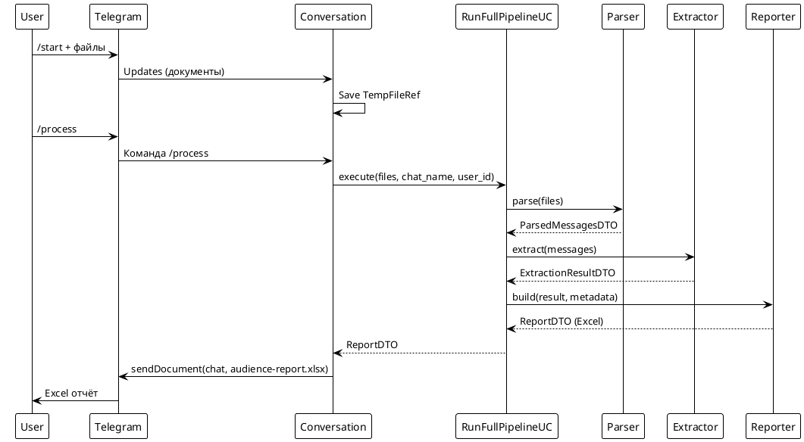

# Key Sequences

## Happy path: загрузка экспортов → Excel отчёт

Этот сценарий покрывает основной поток: пользователь загружает экспорт, запускает обработку, и при большом числе участников получает Excel-файл. Вариант с plain-text отличается только шагом Reporter, который возвращает текстовый список.***
